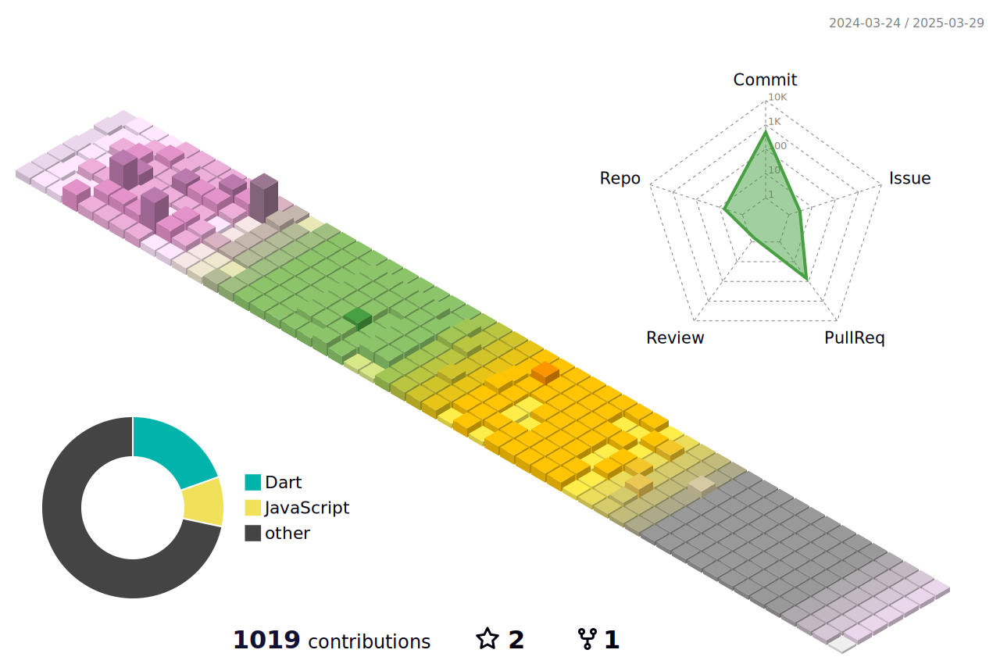

## Hi! I'm Sohui 👋
A Front-End Developer from South Korea

🍀 *“Fake till you make it.”* 

🍀 **도전**과 재미있는 **실패**를 즐깁니다.

🍀 디지털 시대에 소외되는 사용자가 없도록 끊임없이 고민하고 노력하는 개발자를 꿈꿉니다.

 

🌊 Skills
-------------
**Front-end**  

 

**Back-end**  

 

**App**  

 

**Tools**  

 

**Etc**  

  
  
  
  

